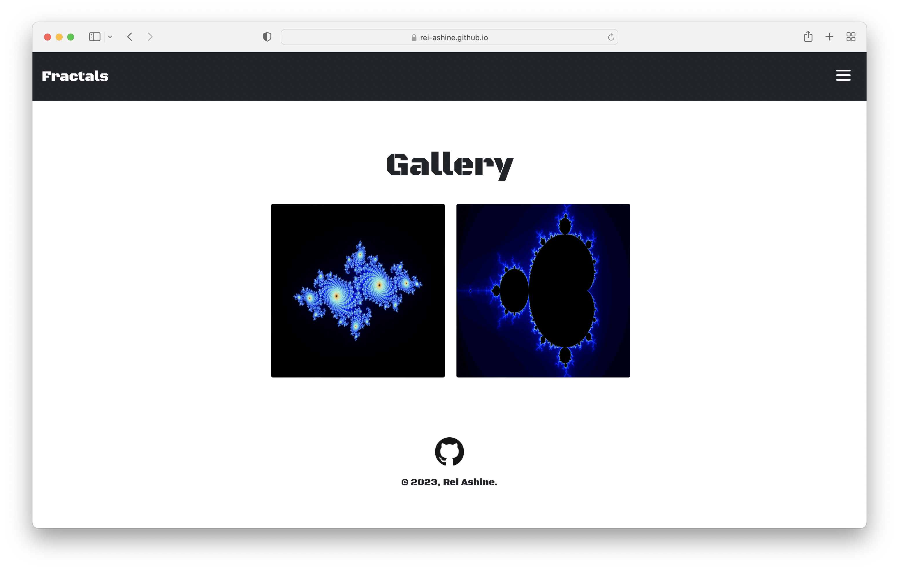

# [WASM-Fractal](https://Rei-Ashine.github.io/wasm-fractal/www/dist/)

DATE: Jan. 20th, 2023



## Directory Structure
```
.
├── Cargo.lock
├── Cargo.toml
├── PNG
│   └── WASM-Fractal.png
├── README.md
├── pkg
│   ├── package.json
│   ├── wasm_mandelbrot.d.ts
│   ├── wasm_mandelbrot.js
│   ├── wasm_mandelbrot_bg.js
│   ├── wasm_mandelbrot_bg.wasm
│   └── wasm_mandelbrot_bg.wasm.d.ts
├── src
│   ├── julia.rs
│   ├── lib.rs
│   ├── logic.rs
│   ├── mandelbrot.rs
│   └── utils.rs
├── target
│   ├── CACHEDIR.TAG
│   ├── debug
│   ├── release
│   └── wasm32-unknown-unknown
└── www
    ├── LICENSE-APACHE
    ├── LICENSE-MIT
    ├── README.md
    ├── bootstrap.js
    ├── dist
    ├── index.html
    ├── index.js
    ├── node_modules
    ├── package-lock.json
    ├── package.json
    ├── public
    └── webpack.config.js

11 directories, 25 files
```
---
```
===============================================================================
 Language            Files        Lines         Code     Comments       Blanks
===============================================================================
 CSS                     1          141          132            0            9
 JavaScript              6          536          405          101           30
 JSON                    2         3763         3763            0            0
 Markdown                2           81            0           58           23
 Rust                    5          325          229           46           50
 TOML                    1           14           12            0            2
-------------------------------------------------------------------------------
 HTML                    4          407          299           42           66
 |- JavaScript           4           32           32            0            0
 (Total)                            439          331           42           66
===============================================================================
 Total                  21         5267         4840          247          180
===============================================================================
```